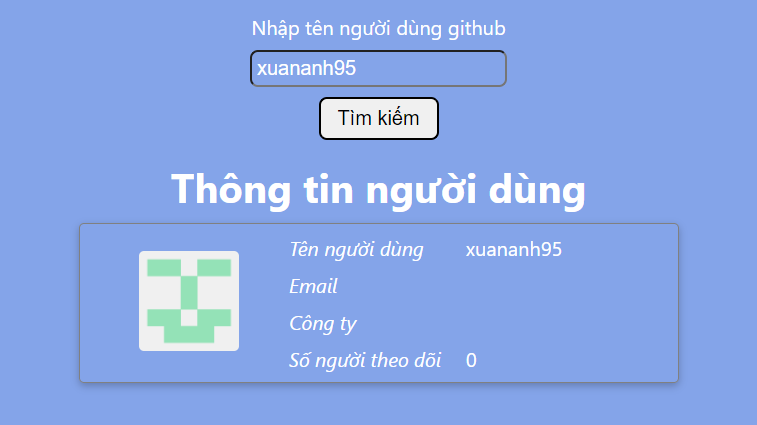
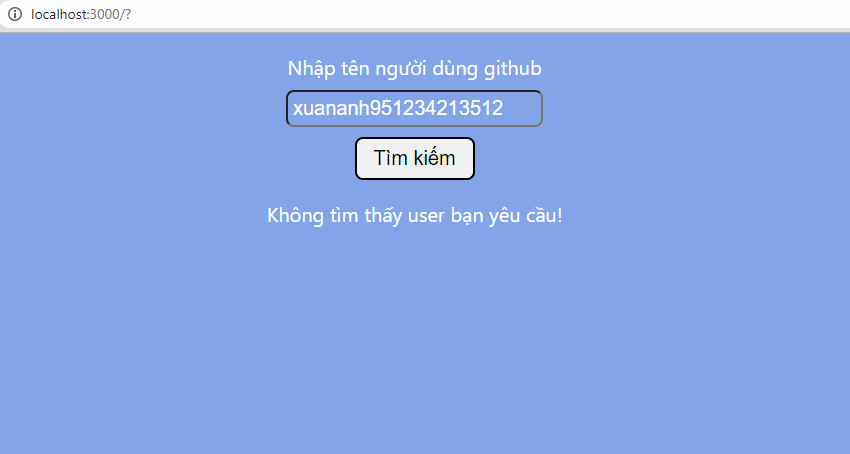

# Homework 2

## Tasks

-   [x] Nhập vào tên user từ input
-   [x] Hiển thị thông tin của user từ github dựa vào API của github (Các thông tin cần lấy ra : Tên, avatar, email, tên công ty, số lượng người follow)

## Demo

Click [here](https://www.delicate-ganache-fbd123.netlify.app) to see the demo version

## Screenshots

